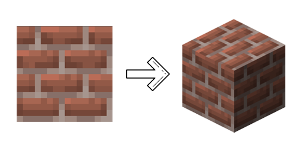
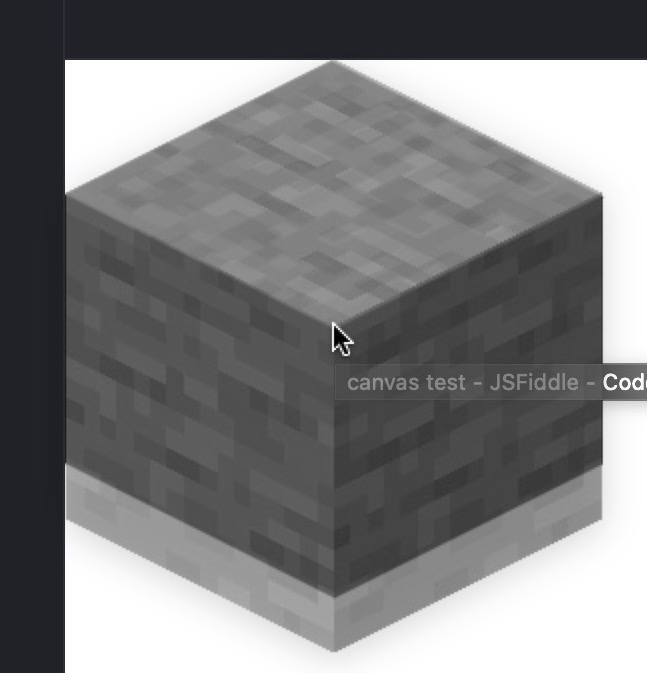
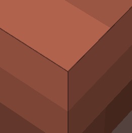

[](https://www.npmjs.com/package/minecraft-blocks-render) [](https://github.com/TABmk/minecraft-blocks-render/blob/master/LICENSE) [](https://www.npmjs.com/package/minecraft-blocks-render)

__Help__ [](https://github.com/TABmk/minecraft-blocks-render/issues?q=is%3Aopen+is%3Aissue) [](https://github.com/TABmk/minecraft-blocks-render/pulls?q=is%3Aopen+is%3Apr)

__Rate__ [](https://github.com/TABmk/minecraft-blocks-render)

<p align="center">
  
</p>

#### Minecraft sprites to isometric cube render.

With only few steps you can render your own __actual__ minecraft blocks icons.

## Install
```
npm i -g minecraft-blocks-render

or

yarn global add minecraft-blocks-render
```

## Usage
To render blocks, you need to get sprites. So we can just grab it from any `.jar` file, that you can find on `/minecraft/versions/YOUR_VERSION/x.xx.x.jar` after installing it from launcher.

https://help.minecraft.net/hc/en-us/articles/360035131551-Where-are-Minecraft-files-stored-

|OS|path|
|---|---|
|OSX|`~/Library/Application\ Support/minecraft/versions`|
|Windows|`%AppData%/.minecraft/versions`|
|Linux|`~/.minecraft/versions`|

## mbr grab

#### options

|option|description|required|
|---|---|---|
|`-f`, `--file`|Load a file|true|
|`-d`, `--debug`|Shows debug info of extraction|false|

##### Example: `bin grab -f 1.16.2.jar -d`

Make any folder and put `.jar` file on it.

And run command `mbr grab` on it

```
cd my-folder
mbr grab
```

`grab` will copy folders `block` and `item` from `/assets/minecraft/textures` in .jar file to local folder called `grab`

## mbr render

#### options

|option|description|required|default|
|---|---|---|---|
|`-r`, `--reducer`|Image bit depth reducer. Bigger number will do more color reduce.|false|`1`|
|`-s`, `--scale`|scale image without reducing quality. `Warning!` May cause edges bugs|false|`1`|
|`-t`, `--type`|`base` will generate JSON file where key - block name, value - base64 string. `png` will render png images for each block|true||
|`-d`, `--debug`|Shows debug info of extraction|false||

##### Example: `mbr render -t base -r 32 -s 10 -d`

After grabbing sprites you can render your blocks with command `mbr render`

If you use type `png` all output images will be saved to `grab/rendered`

Type `base` will save your renders to JSON file `grab/rendered.json`. Where key — bukkit name, value — base64 string.

##### rendered.json example
```
{
  "name": "ACACIA_LOG",
  "icon": "data:image/png;base64,iVBORw0KGgoAAAANSUhEUgAAACAAAAAjCAYAAAD17ghaAAAABmJLR0QA/wD/AP+gvaeTAAAHs0lEQVRYhbWXXYtdVxnHf89aa7+cc2Yyk7S1RVBQFPQzCAo1EzKBlorEUuhFL4TeCJb5AH6E3HonYkEIil6o9GY+gR+g0pJpm6ZmkslMZiZzXvbe6+XxYu29J+mLbYouOGw4L2v9n+f/sp5j+ZrrFy9f+fEPf/C9b7/73t7HX3cPAHnaH/z6zde3QtSdruuudt7T+XBX0Lf++Od//On/CuDNN65vqbIDXFXAiAFAVQkhsmrbu84Wb719869PBeRLAVx/+adbs9mFnbXZ9GpVlayaFfPlElUoi4K6qrDWUpYlXdfRdd1dUd767e9vfiUgXwjgl69f3zJWdnzwV+eLOc46ppMpKSXariXEiLOOsigQIxhjqKuK6WRC+xRAPgPgtetXti7MNncubm5cnS+WnD6aU5UlSqLrOoyxlEVBiBFVxRgBzb9VFGstdVVRVSVt2xFC+K9ARgBvvnF9K0R2QuiuqirOGjY2LnBhbZ39+w9o2pbNC+vMZlMeHp+iqqyvzfAhkFLC+0BMCSOCtYYQIt57lqsl0+mUuqo+F4i88drLWxubGzuCXA0hDqiJKSIipJSw1lK4XLVzluefe4YQI/P5EhFDXZWsmoam7SicxVqLc5YYI4vlagRZVzWFs08AkVd/dk1VEpc2NzBiODk9yxtYCwKqiZTyyzkHCGVRMJtNiTEDbtuOonDMZtMMpGmoqpK6qiiLgrbzNE2bK5aslxDj3VsffPQ7+flLV7RpGy5ubuBDwFlDVVVoz2tdlVRl2YvP03Ye6Ylbm02xxtC0HTFGvA8YY3DO0nYtXddRFAXGGIqiwLks2qOjEz64fYeDw4e4AZUYgyaIonjvKYqStmtJKXM5mdTMZhPquuppyhSklEga6XzHN194ngvr6xwenRBiYjYrM50xEmPDo7MFDw4fcvpoTkoJAGedpT1raZqWFBOrxhNT4JmLlyhcgapyevaIEAOXLl5kUlcUzrFYrlBVkiYKW1DXNYdHxxwdH/PCc9+gKgsenpyQkrJYLNk/OOTsbEEI4QnzuaosEYHlcoWIARQjBhGYz5dYazHG4n3g/sEDLl3cpK5q6rrCOUfXdagqqsrabA1Q7j04xHtP23juHRyyf++Aqq6wxpJSwhibuy6Cs9ZgbX5jMLQIWGtGDk9OT3ju2WeZTSc0radpPWVRYE12gDEGVSWmlJ8hsX/vkPsHR+d+U+h8hybFGDDGYFVxquBcgSBZeKKkpHgfhnwBoPMeWWWQZVEQY+iryQIri4LDoxM+vP0xR8enTOqaGGPuoM0AU4yIMU+4wS0WS5x1+OCx1o22Wy6bc6E4R+qra9qWlJSJVJRFSUK5u3+fk5Mzjo5PCTEg5AqHAkQMiiJiEBFUdey2W64aqrIgqVIagzGWEAIhRATpbeTQpJzNF4iAIHgfaNpj5osl+/cOmEzqUQsiENMQ1flQQRAjT1BNBirEFEkpIZKrNcaCZJSbm+tjNT5kvyv0VcDh0TEiEGIgxDhS6X1ARKjrKmvK2QwG6V2QnWAK54gxgqYxD6wxpKSIMVRlgTGCEYM1ljwLCNbasYqc++Fcb6o9fYq1uQPWGMyQYOfn40wviiwmN/IXU6Isc4xaaykLR4gOyN4vXTkKiZ6WMdQ0nyLCKFT6zkjmMGsKxQBUZYVzBWVZjqIRMVRl2WeBwTmHczYLShNioHAOZ805iP4mzN9RrLG0re9dqH2huXzvfbbkoMoh9fIrgeb2tW33hG2MyHhPOJctlnMAxOTDh8vC9jdiSjrqTkRAlRSzw0xdV7S+Q0SIMWWR9Sd4H8eZTxk2OY/RAXx+pkytCEYyIQPnqXeEoiCZmkyFYC5d2sD0934WjxJjAoHFctEnW0BT3sAY6SP7sYCi97Y8ViWMe6oypqSMFPcgUaUsC2JKxJgQIyOfq2Y1WvA8lB63U7bb0LFB0Lla6Do/dkRTpnX4fEhEM1+sMGLxwRNjxPXDiO0Pmc0miOQRK2nqdQA++LHanCGShxh0BBRioCiK0bJJdbSr6+8fM3AzJJYxgnOWsnSIETYurFGV/RAaFTG53atVQ9KE7Suxxo4Upl4XAHVdjpYbMiAnYm/RGPw1TWkX8gchREQMXRcwYkgpEWLMytXUX9XZRin2lTs33ogDz6aP3zwz6EjZ0K2UlC6EXfOHm3975y9/392KyV+LKe52nUdVqaoSVeVsvuydQf9MfbfOhTjk/+N2tTZnQ9t22dY5mgbH7MYYrn3w4cdbY57e2rtz61/v7b39/e98659i5PmiKL67XC4xxtB2HmctMaUc0X0FzjkeHp/iQxgvnEGIwyArYggx9DrQ3Rjir97fu/2bo+PTW0+a+lPr1Ve2t0/OznbWptPLi+WSsizxwVMWZZ77fcA5x95Hd1iuVhgx40A6tHm1WlGWFW3b7ApyY+/2J+98+pwv/W/40vaL223T7Uwn1WUfsq0mk0nOBVU+2T/g9NEjQgiURTmGk7WGxarZlSQ39m7f/szBXxnACOTKT7bFyA7C5eE/YkrKnbv3ODub40PoJ6UE6K4Rc+Pd9/e+8OCnBjCs7Ss/2l6fru+kpJdDjNz59z7LZUPMPO92bfe5rf6fARjWK9svbnvvd/YPji4vV6vdVedv3H6Kg4f1H6ZD4VrmheS0AAAAAElFTkSuQmCC",
  ...
```

You can test base64 images here https://base64.guru/converter/decode/image

### TODO

We have few ideas for project improvement. You can help by sending PR 🤗

- [x] create npm package
- [ ] `renderSides` option for render command (allow render even `*_top`/`*_bottom`/etc blocks)
- [ ] `renderTransparent` option for render command (allow render block with transparent textures)
- [ ] `noShadow` option for render command
- [ ] `name` option for render command (allow render only one block by name)
- [ ] `items` to base64 converter
- [ ] cleaning up `items` from extra icons like `clock_09` or `bow_pulling_1`
- [ ] add more info to json like in-game item ID and old style ID
- [ ] add tests
- [ ] rewrite code to classes (?)
- [ ] API (?)
- [ ] some blocks (like glass pane) using 2D sprite for preview. Need list of items which must be saved as sprite

### Some researches

Without looking at the minecraft code, we created almost the same looking 3D preview of block as the inventory one.

#### Width


As we know, width of cube in isometric projection is 1/sqrt(3) by ISO 5456-3. But as we can read [here](https://www.compuphase.com/axometr.htm), games often use 1/2 (0.5). Minecraft is no exception, so we used 1/2 width formula and +20% height of front sprites to make it similar with game;



#### shadows



We see 2 different shadows on the sides of the block.. By doing some math [@Kurikaeshiru](https://github.com/Kurikaeshiru) found regularity in RGB shifts. So we just shift each value of RGB with formula

`color /= 1.25 * multiplier`

Multiplier is used for the second shadow, which is darker
